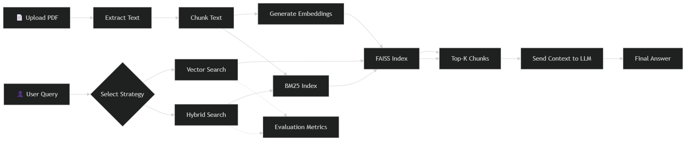

# RAG Comparison: Vector-Only vs. Hybrid Retrieval Engine

A high-performance Retrieval-Augmented Generation (RAG) system built to compare semantic vector search against hybrid keyword-vector retrieval strategies. This system utilizes FAISS for vector indexing, BM25 for keyword search, and Groq-powered Llama 3 models for high-quality response generation.

## 🏗️ System Architecture

The system is designed as a modular pipeline with distinct layers for data handling, intelligence, and presentation.

### High-Level Workflow



### Architectural Layers

1.  **Presentation Layer (Streamlit)**: High-performance dashboard providing an interface for document uploads, interactive querying, and real-time visualization of performance metrics via Plotly.
2.  **Application Layer (Controller)**: Orchestrates the flow between the retrieval engine and the generation client, managing parallel execution of search strategies to minimize user-perceived latency.
3.  **Retrieval Engine (Intelligence)**: 
    *   **Semantic Layer**: Uses `Multi-QA MPNet` embeddings and FAISS (Inner Product) for deep conceptual matching.
    *   **Keyword Layer**: Employs the `BM25Okapi` algorithm for precise token matching, crucial for technical terms or specific identifiers.
4.  **Generation Layer (Groq)**: High-throughput inference leveraging Llama 3.3-70B models hosted on Groq's LPUs for near-instant response synthesis.
5.  **Storage Layer**: Persistent local storage using FAISS binary indices and Python pickling for extremely fast loading and indexing during ingestion.

---

## 📝 Assumptions and Design Decisions

-   **Document Content**: The system assumes documents are text-searchable PDFs. It does not currently include OCR for scanned images or handwritten text.
-   **Connectivity**: An active internet connection is required for Groq Cloud LLM inference and for the initial download of the `sentence-transformers` model.
-   **Security**: API keys are managed via environment variables (`.env`) to prevent exposure in source code.
-   **Storage**: The `data/` directory is used for local persistence. It is assumed the environment has write permissions to this directory.
-   **Benchmarking**: Evaluation metrics (Precision/Recall) are based on the presence of ground-truth substrings within retrieved chunks, providing a heuristic for relevance rather than human-labeled semantic absolute truth.
-   **Resource Usage**: Embedding generation is performed locally. While it supports GPU acceleration if available (via PyTorch), it is designed to run efficiently on standard CPUs.

---

### Core Components Detail

- **Frontend (Streamlit)**: A sleek, interactive dashboard for uploading documents, querying the system, and visualizing performance metrics.
- **Ingestion Pipeline**: 
    - **Extraction**: Extracts raw text from PDFs using `pdfplumber`.
    - **Chunking**: Implements a sliding window semantic chunker to maintain context boundaries.
    - **Embeddings**: Uses `sentence-transformers` for local, high-quality vector representations.
- **Vector Database (FAISS)**: Fast and efficient similarity search using Inner Product (normalized for Cosine Similarity).
- **Hybrid Retrieval**: Combines BM25 (keyword-based) with Vector Search (semantic-based) to improve retrieval accuracy for technical terminology and specific keywords.
- **LLM Integration**: Leverages Groq's high-speed API to run Llama 3.3-70B for synthesis and reasoning.
- **Benchmarking Suite**: Real-time evaluation of Precision@k, Recall@k, and Latency to provide data-driven insights into strategy performance.

## 🚀 Getting Started

### Prerequisites

- Python 3.9+
- A [Groq API Key](https://console.groq.com/)

### Installation

1. **Clone the repository**:
   ```bash
   git clone <repository-url>
   cd Retrieval-backend
   ```

2. **Install dependencies**:
   ```bash
   pip install -r requirements.txt
   ```

3. **Configure Environment**:
   Create a `.env` file in the root directory and add your Groq API key:
   ```env
   GROQ_API_KEY=your_api_key_here
   ```

### Running the Application

Launch the Streamlit dashboard:
```bash
streamlit run app.py
```

## 📊 Key Features

- **Document Ingestion**: Bulk upload PDFs and automatically build both vector and hybrid indices.
- **Parallel Processing**: Comparative queries are executed in parallel to minimize wait times.
- **Visual Analytics**: Interactive Plotly charts compare precision and latency across different retrieval methods.
- **Compliance Focused**: Includes a built-in benchmark tailored for policy and compliance documents.

## 📂 Project Structure

- `app.py`: Main Streamlit application entry point.
- `src/`: Core source code.
    - `ingestion.py`: Document processing and text extraction.
    - `embedder_faiss.py`: Chunking, EMBEDDING, and FAISS storage logic.
    - `retrieval.py`: Implementation of Vector and Hybrid search algorithms.
    - `generation.py`: LLM client for response synthesis.
    - `benchmark.py`: Performance testing framework and ground truth data.
    - `config.py`: Centralized configuration management.
- `data/`: Local storage for the FAISS index and processed chunks.
